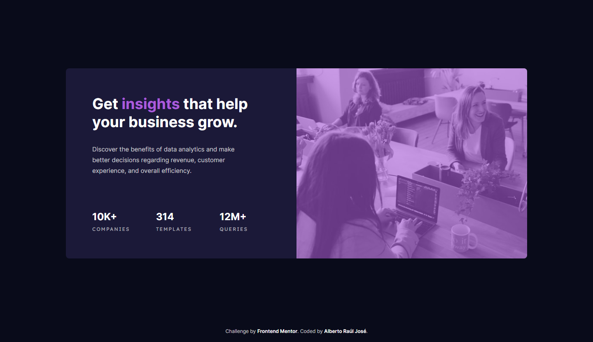

# Frontend Mentor - Stats preview card component solution

This is a solution to the [Stats preview card component challenge on Frontend Mentor](https://www.frontendmentor.io/challenges/stats-preview-card-component-8JqbgoU62). Frontend Mentor challenges help you improve your coding skills by building realistic projects.

## Table of contents

- [Overview](#overview)
  - [The challenge](#the-challenge)
  - [Screenshot](#screenshot)
  - [Links](#links)
- [My process](#my-process)
  - [Built with](#built-with)
- [Author](#author)

## Overview

### The challenge

Users should be able to:

- View the optimal layout depending on their device's screen size

### Screenshot

  
Mobile version

  

  
Tablet version

  

  
Desktop version

  

### Links

- [Solution](#)
- [Live Site](#)

## My process

### Built with

- Semantic HTML5 markup
- CSS custom properties
- Flexbox
- CSS Grid
- Mobile-first workflow

## Author

- Github - [Alberto Raúl José](https://github.com/alberto-rj)
- Frontend Mentor - [@alberto-rj](https://www.frontendmentor.io/profile/alberto-rj)
- Twitter - [@albertorauljose](https://www.twitter.com/albertorauljose)
